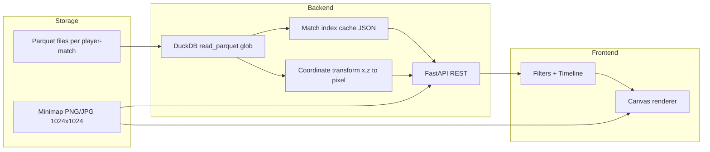

# Architecture — Player Journey Visualization Tool

## Tech stack rationale

**FastAPI + DuckDB + React (Canvas)** was chosen to balance polish, performance, and delivery speed.

- **DuckDB** queries all 1,243 parquet files via glob without loading everything into memory; aggregations (match index, heatmaps) run in-process in seconds.
- **FastAPI** serves a typed REST API and static production frontend from one deployable unit (Docker / Render).
- **React + Canvas** overlays paths and markers on raster minimaps with precise pixel control—important because coordinates are pre-computed server-side to match the 1024×1024 image space.

Alternatives considered: Streamlit (faster prototype, weaker UX), Next.js + parquet-wasm (no Python, but heavier client bundle and slower initial parse on 89k rows).

## Data flow



1. **Ingest:** Parquet rows contain `user_id`, `match_id`, `map_id`, `x`, `y`, `z`, `ts`, `event` (bytes).
2. **Process:** Events decoded to UTF-8; bots detected via numeric `user_id`; positions filtered from combat/loot events.
3. **Transform:** `(x, z)` → minimap pixels using per-map scale/origin (see below).
4. **Serve:** JSON payloads with pre-computed pixel paths for one match or grid heatmap intensities per map.
5. **Display:** Canvas draws minimap image, optional heatmap grid, polylines (human solid / bot dashed), and event glyphs.

## Coordinate mapping

### Formula

For map with `scale`, `origin_x`, `origin_z` and image size 1024:

```
u = (x - origin_x) / scale
v = (z - origin_z) / scale
pixel_x = u * 1024
pixel_y = (1 - v) * 1024   # flip Y: image origin top-left
```

Implemented in `backend/coords.py` → `world_to_pixel()`.

### Per-map constants (from dataset README)

| Map | Scale | Origin X | Origin Z |
|-----|-------|----------|----------|
| AmbroseValley | 900 | -370 | -473 |
| GrandRift | 581 | -290 | -290 |
| Lockdown | 1000 | -500 | -500 |

### Edge cases handled

- **`y` column ignored** for 2D plotting (elevation only).
- **Lockdown `.jpg`** vs PNG: same 1024×1024 logical space; served as static file.
- **Out-of-bounds UV:** Rare world coords may plot outside 0–1024; canvas clipping handles visibility.
- **`event` bytes:** Cast/decoded to string before filtering event types.
- **`match_id` suffix:** Queries strip/normalize `.nakama-0` for consistent joins.

### Testing methodology

1. **Documentation example:** AmbroseValley `x=-301.45`, `z=-355.55` → `(78, 890)` per README; verified against `world_to_pixel()`.
2. **Cross-map smoke test:** Loaded matches on all three maps; paths visually align with minimap features (roads, compounds).
3. **Bot vs human:** Filename and `user_id` regex (`^[0-9]+$`) agree on bot classification.

## Bot detection

| Signal | Rule |
|--------|------|
| Primary | `user_id` matches `^[0-9]+$` → bot |
| Secondary | Events `BotPosition`, `BotKill`, `BotKilled` |
| Visual | Dashed gray path vs solid cyan |

## Assumptions

| Ambiguity | Resolution |
|-----------|------------|
| Timestamp semantics | `ts` treated as orderable match timeline via `epoch_ms()`; playback uses relative offset from match `time_range`. |
| Date range filter | Single-day folder filter implemented; multi-day range via repeated queries or “All days” left for v2. |
| Kill/death PvP counts | Very low in sample (3 human kills); heatmaps include `BotKill` / `BotKilled`. |
| Data in repo | `player_data/` excluded from git; download required for deploy. |

## Tradeoffs

| Decision | Alternative considered | Why chosen |
|----------|------------------------|------------|
| DuckDB server-side | Client parquet-wasm | Faster queries, smaller browser bundle |
| Pre-computed pixel coords | Transform in browser | Single source of truth; simpler frontend |
| Canvas overlay | Leaflet | Minimap is static image; Canvas sufficient |
| Match index JSON cache | Query on every request | 796 matches; 1-time build ~5s, instant listing after |
| Monolith deploy | Split Vercel + Railway | One Docker image; easier reviewer setup |
| Grid heatmap (40×40) | Kernel density | Predictable performance on 89k rows |

## Performance

- Full match index build: ~5s (cached to `player_data/.match_index.json`).
- Single match load: ~100–500ms depending on player count.
- Heatmap per map: ~2–5s (aggregates all files for map).
